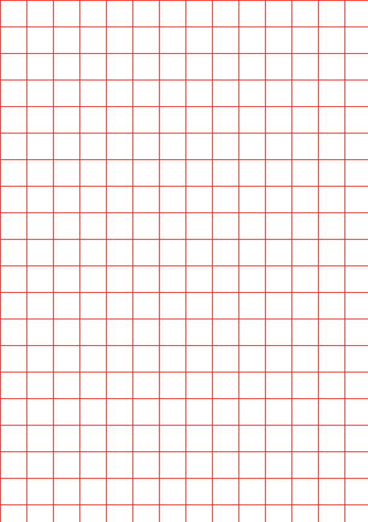

## Senior Project | Thai Hand Written Recognition using CNN (ResNet50)
This is just one part of my Senior Project, the preprocessing phase."

## ACKNOWLEDGEMENTS
The research team extends heartfelt thanks to everyone who supported us. 
  We are grateful to Assoc. Prof. Dr. Chomthip Pornpanomchai for invaluable guidance and advice, 
  as well as to all teachers, senior colleagues, and parents for their unwavering support

## Objectives
The goal of Thai handwritten recognition is to create technology that accurately converts handwritten Thai script into digital text. This involves using deep learning techniques like Convolutional Neural Networks (CNNs) to improve accuracy. By leveraging machine learning methods and large datasets of handwritten Thai characters, we aim to develop systems capable of recognizing diverse writing styles. Ultimately, our research aims to make Thai handwritten recognition a valuable tool for various industries and individuals in the digital age.

## Members
Mr. Thanawath 		Huayhongthong		6388016 
  Resposible on GUI Displaying
  
Mr. Dhammawat		Siribunchawan		6388055
  Resposible on Trainning and Devleoping member process
  
Mr. Naphat			Sookjitsumrarn		6388059
  Resposible on Evaluating

## System Structure Chart

## Preprocessing 
The Thai alphabet comprises 44 consonants, 21 vowels, 4 intonation marks, and 79 writing forms in total. The project needs convenient methods to retrieve the data by implementing an easier screen capture of the paper. One of the methods is creating a writing table template by implementing the Pillow library in Python.
  
The code provided among this repository are 
- Table Generator
- Paper Slicer
- Size Check

## Table Generator
**Required library:** PIL (Python Imaging Library) 
  **Command:** pip install pillow
  The script will generate an image file named `A4.png` containing a table drawn on an A4-sized canvas.
  The script defines a function `generate_table_on_a4()` that creates a table with red grid lines on an A4-sized canvas. The table cells have a default size of 44x44 pixels.
 `Result` 

## Paper Slicer
This Python script performs image processing operations such as replacing red pixels with white, enhancing brightness, and slicing an A4-sized image into smaller squares.
**Required library:** PIL (Python Imaging Library) 
  **Command:** pip install pillow

As you see that the template contain red lines, after we collect the calography image and put to the progeam.
  The script will eplaces red pixels in the input image with white pixels based on a distance threshold. It returns the modified image.
  Then slices an A4-sized image into smaller squares and applies image processing operations to each square. It saves the processed squares in the specified output folder.
**Don't forget to change the output after pulling this repository**
 `if __name__ == "__main__":`
     `slice_a4_image("1.jpg", "C:\\Users\\Jigsaw\\Desktop\\Paperslicer\\เ-ะ", 88)`

## Size Check
Just check the size of the paper because shen you retrieve a scanning paper (with caligraphy), the resolutions and size may have changed

## Data Chosen 
When croping, the program will skip the last row and column because the image containing black space will not be selected. 
  The image that contain the black space is because the changed resolution of the caligraphy paper but the script originally size of the small image.
  Actually we can replace mentioned black space with better solution.
 
`Data chosen` 

 
`Data with black space` 

